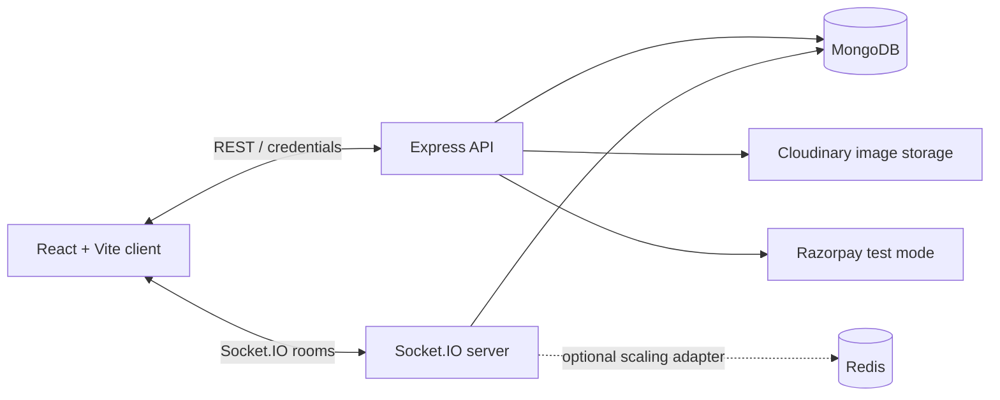

# BidArena

**A real-time auction platform for creating, discovering, and participating in live auctions.**

[Live application](https://bidarena-indol.vercel.app) · [API contract](./docs/API_CONTRACT.md) · [Socket contract](./docs/SOCKET_CONTRACT.md)

## Overview

BidArena is a full-stack marketplace where users can create auctions, discover listings, join live auction rooms, place bids, follow activity in real time, chat with participants, and complete winner payments. The server owns auction state, bid ordering, lifecycle transitions, and payment verification; the client presents that authoritative state through a responsive interface.

## Highlights

- Account registration, login, logout, protected routes, and session restoration
- Auction discovery with status filters, sorting, pagination, and public auction details
- Seller controls for creating, editing, managing, and uploading auction images
- Live Socket.IO auction rooms with authoritative snapshots, presence, bid activity, statistics, timeline updates, and chat
- Server-side auction lifecycle management, deterministic per-auction bid processing, completion recovery, and winner selection
- Razorpay test-mode winner payment flow with server-side order and signature verification
- Responsive desktop and mobile layouts with loading, empty, validation, and error states

## Product flow

1. Register or log in to restore an authenticated session.
2. Browse upcoming, active, and completed auctions.
3. Sellers create and manage eligible auctions; participants open a live room.
4. The client joins the room and renders a server-authoritative snapshot.
5. Valid bids and chat messages are persisted before room updates are broadcast.
6. At completion, the server declares the winner once; the winner can complete payment through Razorpay test mode.

## Architecture



The browser submits intent; it does not decide bid validity, timer expiry, auction completion, winner selection, or payment status. The backend persists authoritative changes before broadcasting them to an auction room. Each auction uses isolated room and bid-processing state so activity from one listing does not affect another.

## Tech stack

| Area | Technologies |
| --- | --- |
| Client | React 19, Vite, React Router, React Query, Socket.IO Client, Tailwind CSS, GSAP |
| Server | Node.js, Express, Socket.IO, Mongoose, Zod, JWT, bcryptjs |
| Data and services | MongoDB, Cloudinary, Razorpay test mode, Redis / Socket.IO Redis adapter |
| Quality | ESLint, Vitest, Testing Library, Supertest |

## Repository structure

```text
bidarena/
├── client/                 # React + Vite application
│   └── src/
│       ├── components/     # Shared UI and live-room panels
│       ├── context/        # Authentication state
│       ├── hooks/          # Auction-room and UI hooks
│       ├── pages/          # Marketplace, account, seller, and room pages
│       └── services/       # REST, Socket.IO, and payment clients
├── server/                 # Express + Socket.IO application
│   └── src/
│       ├── controllers/    # HTTP request handlers
│       ├── engine/         # Per-auction bid queue
│       ├── models/         # MongoDB models
│       ├── services/       # Auction, auth, chat, payment, and lifecycle services
│       ├── sockets/        # Auction-room events and snapshots
│       └── tests/          # Server verification
└── docs/                   # API and Socket.IO contracts
```

## Local development

### Prerequisites

- Node.js `^20.19.0 || >=22.12.0`
- npm
- MongoDB connection string
- Cloudinary credentials for image uploads
- Razorpay test keys for winner payments

### Configure environment

Copy the example files before starting. Do not commit real `.env` files.

```powershell
Copy-Item client/.env.example client/.env
Copy-Item server/.env.example server/.env
```

Client variables:

```text
VITE_API_URL=http://localhost:5000/api
VITE_SOCKET_URL=http://localhost:5000
```

Server variables:

```text
NODE_ENV=development
HOST=0.0.0.0
PORT=5000
CLIENT_URLS=http://localhost:5173
MAX_BID_AMOUNT=1000000000
MONGODB_URI=your_mongodb_connection_string
JWT_ACCESS_SECRET=your_access_token_secret
ACCESS_TOKEN_EXPIRY=15m
SESSION_COOKIE_SAME_SITE=lax
CLOUDINARY_CLOUD_NAME=your_cloud_name
CLOUDINARY_API_KEY=your_api_key
CLOUDINARY_API_SECRET=your_api_secret
RAZORPAY_KEY_ID=rzp_test_replace_me
RAZORPAY_KEY_SECRET=replace_with_test_key_secret
```

### Run locally

Install dependencies in each workspace, then start the API and client in separate terminals.

```powershell
cd server
npm install
npm run dev
```

```powershell
cd client
npm install
npm run dev
```

The client defaults to `http://localhost:5173`; the server defaults to `http://localhost:5000`.

## Scripts

| Workspace | Command | Purpose |
| --- | --- | --- |
| `client` | `npm run dev` | Start the Vite development server |
| `client` | `npm run build` | Create a production build |
| `client` | `npm run lint` | Lint client code |
| `client` | `npm test` | Run client tests |
| `server` | `npm run dev` | Start the server with nodemon |
| `server` | `npm start` | Start the production server |
| `server` | `npm run lint` | Lint server code |
| `server` | `npm test` | Run server tests |

## Testing and quality checks

Run the focused checks from their respective workspaces:

```powershell
cd client
npm run lint
npm test
npm run build
```

```powershell
cd server
npm run lint
npm test
```

The API also exposes `GET /health` for dependency-free liveness and `GET /ready` for MongoDB readiness.

## Deployment notes

The frontend is live at [bidarena-indol.vercel.app](https://bidarena-indol.vercel.app). Production deployments must configure the client API and Socket.IO URLs, server credentialed CORS origins, MongoDB, Cloudinary, JWT, and Razorpay test-mode environment variables. Use HTTPS when deploying cross-site HTTP-only session cookies.

## Security notes

- Passwords are hashed with bcryptjs; safe user representations exclude password data.
- Authentication uses HTTP-only JWT session cookies, with secure production cookie settings.
- Protected routes derive identity from verified credentials, never client-provided user IDs.
- Auction images accept only supported image types and size limits.
- Razorpay order creation and signature verification are handled server-side.
- Secrets belong only in local or deployment environment configuration, never in source control.

## Team

| Contributor | Focus |
| --- | --- |
| Subham | Marketplace and UX: authentication, auction management and discovery, responsive interface, live-room UI, seller experience, and payment UI |
| Rohit | Auction engine and real-time state: Socket.IO rooms, bid validation and ordering, lifecycle and recovery, persistence, chat backend, and payment verification |

## Project links

- Live application: [https://bidarena-indol.vercel.app](https://bidarena-indol.vercel.app)
- Repository: [Subham3008/bidarena](https://github.com/Subham3008/bidarena)
- REST API contract: [docs/API_CONTRACT.md](./docs/API_CONTRACT.md)
- Socket.IO contract: [docs/SOCKET_CONTRACT.md](./docs/SOCKET_CONTRACT.md)
