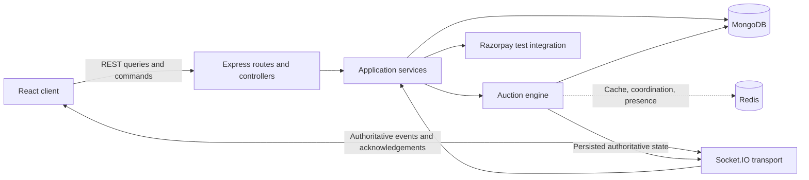

# BidArena Architecture

## Purpose and status

This document defines BidArena's shared architecture boundaries and distinguishes implemented capability from the future product architecture required by `BIDARENA.md`.

The shared foundation provides tooling, contracts, MongoDB startup/readiness, and health checks. The current `subham` work implements HTTP authentication, auction creation/discovery, and their client UX. Auction details, bidding, timers, Socket.IO workflows, chat, payments, Redis integration, and recovery remain unimplemented.

### Inspection baseline

At the start of shared-foundation verification:

- `client/` contained a minimal React and Vite application with the required frontend packages already installed.
- Tailwind CSS was available through the Vite integration, but no BidArena product interface existed.
- `server/` contained the installed Express, Socket.IO, MongoDB, Redis, Razorpay, validation, security, and test dependencies.
- The server had no runnable application entry point, no health route, no scripts, and no feature implementation.
- Redis and `@socket.io/redis-adapter` were server-only dependencies.
- npm lockfiles were the only package-manager lockfiles.

### Shared foundation scope

The accepted foundation for this phase is limited to:

- React, Vite, and Tailwind configuration for a future Domain A client.
- An Express application using ES modules.
- A side-effect-free `server/src/app.js` and a process entry point in `server/src/server.js`.
- A minimal `GET /health` endpoint.
- Environment examples, ignore rules, npm scripts, linting, and the modular server directories.
- Architecture, REST, Socket.IO, Git workflow, and SRS traceability documents.

Except for the documented foundation and HTTP authentication slice, product behavior described later is planned until implementation, testing, integration, and traceability evidence show otherwise.

## Architectural principles

1. **The backend is authoritative.** The client sends commands and renders server state; it does not decide bid validity, the highest bid, the winner, auction completion, payment status, or authoritative timer expiry.
2. **MongoDB is the permanent source of truth.** Redis may improve latency and coordination, but it must not be the only store for critical auction history, winner state, or payment state.
3. **Persist before broadcasting.** A state change must be committed before clients are told it succeeded.
4. **Ordering is deterministic per auction.** Each auction has an independent sequential bid queue and accepted bids receive server-generated sequence numbers.
5. **Time is server-owned.** Auctions use absolute `startAt` and `endAt` timestamps. A client countdown is only a display of server state.
6. **Transport layers stay thin.** React components, Express routes, and Socket.IO handlers delegate business rules to services and the auction engine.
7. **Isolation limits failures.** Auction rooms, bid queues, and chat processing are isolated so one auction or chat failure cannot corrupt another auction's bidding flow.
8. **Contracts are frozen before features.** REST and Socket.IO names, payloads, acknowledgements, and error shapes belong in `API_CONTRACT.md` and `SOCKET_CONTRACT.md`.

## System context



The diagram shows the intended complete product architecture. Currently live HTTP surfaces are health/readiness, `/api/auth`, and creation/discovery at `/api/auctions`; Socket.IO and auction-engine paths remain planned.

## Client boundary

Domain A, owned by Subham on `subham`, owns the marketplace and user experience. Client module areas are:

```text
client/src/
  components/   Reusable presentation and interaction elements
  pages/        Route-level screens
  hooks/        Reusable React behavior
  services/     REST client calls
  sockets/      Socket.IO connection and event adapters
  context/      Shared client session and UI state
  utils/        Focused helpers
  types/        Shared payload and view-model definitions
```

The client may optimistically manage presentation details, but it must replace stale auction data with authoritative snapshots and events from the server. Highest bid, remaining-time authority, winner, and payment status must never be derived independently in the browser.

Future UI work follows the SRS direction: a neutral background, one controlled accent colour, restrained elevation and radii, accessible forms, visible focus states, meaningful loading/error/empty states, and responsive layouts. Fake statistics and generic dashboard decoration are outside the design contract.

## Server foundation and process boundary

### `server/src/app.js`

`app.js` constructs and exports the Express application. It owns application-level middleware and route registration but does not open a network port or start external connections. This keeps the application importable by tests without creating a listening process.

It currently exposes:

```http
GET /health
GET /ready
POST /api/auth/register
POST /api/auth/login
POST /api/auth/logout
GET /api/auth/me
GET /api/auctions
POST /api/auctions
```

with the response:

```json
{
  "success": true,
  "message": "BidArena server is running"
}
```

### `server/src/server.js`

`server.js` is the process entry point. It connects MongoDB before accepting traffic, creates the HTTP server around the Express app, and handles graceful shutdown. In later Domain B work, this remains the composition boundary for Socket.IO, Redis lifecycle, and recovery startup.

Keeping the HTTP server separate from the Express app provides one server that Socket.IO can attach to later while preserving fast HTTP tests against `app.js`.

## Server module boundaries

```text
server/src/
  config/       Environment parsing and infrastructure configuration
  controllers/  HTTP request/response translation
  routes/       REST path and middleware registration
  middleware/   Authentication, validation, errors, and cross-cutting HTTP concerns
  models/       MongoDB schemas and persistence models
  services/     Application workflows and external integrations
  validators/   REST and Socket.IO payload schemas
  sockets/      Connection authentication, room membership, and event adapters
  engine/       Deterministic bid, timer, completion, and winner rules
  jobs/         Recovery, reconciliation, and scheduled processing
  utils/        Small stateless helpers
  tests/        Unit, integration, concurrency, and recovery tests
```

Boundary rules:

- Routes select middleware and controllers; they do not contain auction rules.
- Controllers translate transport input and output; they do not own persistence workflows.
- Socket handlers authenticate, validate, join rooms, and delegate; they do not implement bid or winner logic.
- Services coordinate use cases, persistence, integrations, and the engine.
- The engine owns deterministic auction rules and must not depend on browser state.
- Models express storage boundaries; callers use transactions where a single accepted bid changes multiple records.
- Jobs call the same guarded services used by live requests so restart recovery cannot declare a second winner.

## Authoritative state and data ownership

| Concern | Authority | Client responsibility |
|---|---|---|
| Authentication identity | Verified HTTP session/token or verified socket | Present credentials; never send a trusted `userId` |
| Bid acceptance | Auction engine | Submit `auctionId`, `amount`, and unique `clientBidId` |
| Highest bid and bidder | Persisted server state | Render authoritative response/event |
| Bid ordering | Per-auction queue and server sequence number | Order display by server sequence |
| Auction activity and expiry | Server clock using `startAt`/`endAt` | Display a countdown synchronized to server time |
| Winner and completion | Atomic server completion flow | Render read-only completion state |
| Payment status | Backend-verified Razorpay result | Open checkout and return payment details for verification |
| Recovery snapshot | Server using MongoDB with optional Redis acceleration | Replace stale local auction state |

## Core planned flows

These flows define future Domain B behavior; none is implemented by the health-only foundation.

### Bid command

```text
place_bid { auctionId, amount, clientBidId }
  -> authenticate the socket
  -> enqueue on that auction's sequential queue
  -> load authoritative auction state
  -> validate identity, role, amount, status, endAt, and idempotency
  -> start the MongoDB transaction
  -> update highest bid/bidder and create bid and timeline records
  -> increment the server sequence number
  -> commit the transaction
  -> update or invalidate Redis state
  -> broadcast authoritative state to the isolated auction room
  -> acknowledge the sender
```

Different auctions may process concurrently, but commands for the same auction are serialized. Duplicate `clientBidId` values are rejected or resolved idempotently according to the frozen Socket.IO contract.

### Timer and completion

At or after `endAt`, new bids are rejected. Completion atomically moves an auction from `ACTIVE` to `COMPLETED`, determines and saves the winner once, records timeline events, broadcasts completion, makes the room read-only, and enables the winner's payment flow. The status transition must include an atomic guard so timer, job, and recovery paths cannot create duplicate winners.

### Reconnection

After authentication restoration, the client reconnects, rejoins the auction room, requests the latest state, and replaces its local state with a full snapshot. The snapshot includes auction state, recent bids, timeline, server time, bidder and spectator counts, current-user role, and payment status.

### Server restart

Startup recovery finds upcoming and active auctions, safely completes expired auctions, restores active timers and useful cache state, and prevents duplicate winner declaration. MongoDB is the recovery source when Redis is empty or unavailable.

### Payment

After completion, the backend verifies that the payer is the winner before creating a Razorpay test order. The frontend opens checkout and returns payment details; the backend verifies the signature before changing payment status, recording the timeline event, and broadcasting the update. A frontend-only success result is never authoritative, and auction status remains separate from payment status.

## Redis policy

Redis is an optional acceleration and coordination layer, not a permanent record. Approved future uses include:

- Active-auction state and fast snapshot cache.
- Participant presence and spectator counts.
- Bid idempotency and queue coordination.
- Distributed locks and rate limiting.
- The Socket.IO Redis adapter when horizontal scaling is introduced.

Candidate key families from the SRS are:

```text
auction:{auctionId}:state
auction:{auctionId}:presence
auction:{auctionId}:processed-bids
auction:{auctionId}:lock
```

Every implemented cache must document its value, TTL, invalidation rule, MongoDB fallback, and restart behavior. An unavailable Redis instance must degrade gracefully where the operation can safely fall back to MongoDB; it must not silently weaken correctness guarantees.

## Reliability and security decisions

- Derive user identity from verified authentication, never request payloads.
- Validate every REST and Socket.IO payload before entering services or the engine.
- Reject unauthenticated users, seller self-bids, spectator bids, invalid amounts, late bids, inactive auctions, and duplicate bid IDs.
- Use a separate queue and room per auction to prevent cross-auction contamination.
- Commit authoritative changes before Redis updates and broadcasts.
- Use atomic database conditions and transactions for bid and completion invariants.
- Generate bid sequence numbers on the server.
- Keep chat processing isolated so chat failure cannot stop bidding.
- Treat the server clock and absolute timestamps as authoritative.
- Fall back to MongoDB for recovery; do not reconstruct critical truth solely from Redis.
- Verify Razorpay signatures on the backend and use test mode until release requirements change.
- Keep secrets in ignored environment files; commit examples with placeholders only.
- Add comments where they explain concurrency, transaction, recovery, cache, or isolation decisions, not obvious syntax.

## Ownership and integration boundary

- **Domain A / Subham / `subham`:** visible UI, pages, client state display, frontend Socket.IO adapter, bid controls, timer presentation, marketplace UX, profile, and checkout UI.
- **Domain B / Rohit / `rohit`:** server transport, auction engine, persistence, timer authority, recovery, Redis, Razorpay verification, and backend tests.
- **Shared integration / `developer`:** contract compatibility, authentication hand-off, full bidding and payment flows, multiple-room behavior, reconnection, production build, and deployment rehearsal.

Cross-domain features are split by responsibility. For example, the timer component belongs to Domain A, timer authority belongs to Domain B, and synchronization is verified on `developer`.

## Current authentication increment boundaries

The current branch implements HTTP authentication plus auction creation and discovery. It does not implement or claim completion of:

- Auction details, profiles, and seller analytics.
- Socket.IO authentication, rooms, event handlers, or Redis adapter setup.
- Bid validation, queues, persistence, statistics, heat, or timelines.
- Timers, completion, winners, reconnection, or restart recovery.
- Chat, payments, uploads, dashboards, or deployment.
- Redis production connections or cache behavior.
- Stretch goals such as anti-sniping, proxy bidding, recommendations, or moderation.

Feature status is tracked in `SRS_TRACEABILITY.md`. A future requirement is complete only after implementation, relevant tests, cross-domain integration where applicable, documentation, and placement on the correct branch.
